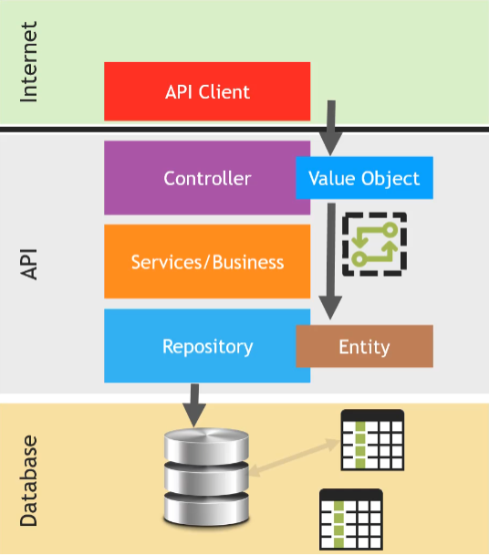

# Value Object (VO) - Annotations

### Como o Value Object funciona na prática?

    Quando é feita uma request em uma API, o que será enviado para o Controller será o VO (Value Object), que será processado e posteriormente convertido para uma Entidade que será armazenada em um banco de dados.

    Desta maneira, sempre será o Value Object que estará sendo transitado pela API, e nunca a Entidade em sí, fortalecendo a segurança e evitando que modifique diretamente a entidade.

### Exemplo de VO no cadastro e retorno de um usuário

É feita uma RequestBody para o cadastro de um usuário no banco de dados, recebe-se UserRequest, que é o VO referente a requisição do Body.

Quando UserRequest chegar em nosso Controller, precisará ser convertido em UserDTO para ser armazenado em nosso banco de dados (UserDTO será idêntico ao UserEntity).

Por fim, para retornar o usuário cadastrado será utilizada a classe UserResponse, que pode ou não conter todos os atributos de UserDTO e de UserRequest.

Sendo assim, será perfeitamente possível de receber um cadastro com os atributos nome, email,  documento e senha (virão no UserRequest) por exemplo, porém retornar apenas nome e email através do UserResponse e tudo sem trafegar a entidade User em sí dentro da API.

Nathan Barros
